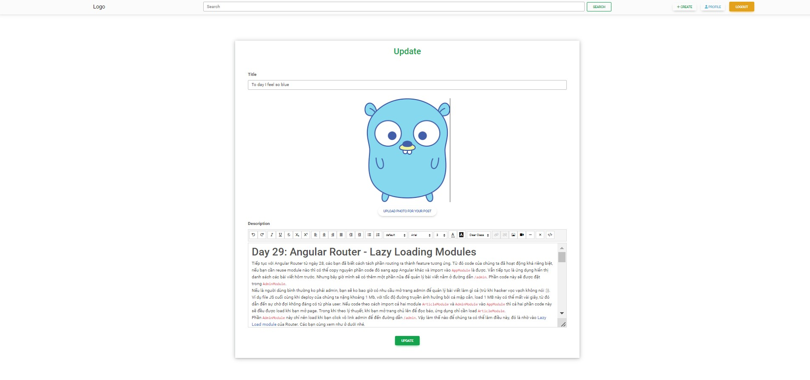

# POST FRONTEND ANGULAR
## Các chức năng chính của dự án
**1. Trang đăng ký**

Cho phép người dùng đăng ký 1 tài khoản mới.

**2. Trang login**

Cho phép người dùng đăng nhập vào hệ thống.

**3. Trang home page**

Trang home cho phép người dùng xem tất cả post trong hệ thống.

**4. Trang create post**

Cho phép người dùng tạo 1 post mới.

**5. Trang edit post**

Cho phép người dùng edit 1 post của họ.

**6. Trang delete post**

Cho phép người dùng xóa 1 post của họ.

**7. Trang profile**

Cho phép người dùng xem và thay đổi profile của họ.

This project was generated with [Angular CLI](https://github.com/angular/angular-cli) version 15.2.4.

## Development server

Run `ng serve` for a dev server. Navigate to `http://localhost:4200/`. The application will automatically reload if you change any of the source files.

## Code scaffolding

Run `ng generate component component-name` to generate a new component. You can also use `ng generate directive|pipe|service|class|guard|interface|enum|module`.

## Build

Run `ng build` to build the project. The build artifacts will be stored in the `dist/` directory.

## Running unit tests

Run `ng test` to execute the unit tests via [Karma](https://karma-runner.github.io).

## Running end-to-end tests

Run `ng e2e` to execute the end-to-end tests via a platform of your choice. To use this command, you need to first add a package that implements end-to-end testing capabilities.

## Further help

To get more help on the Angular CLI use `ng help` or go check out the [Angular CLI Overview and Command Reference](https://angular.io/cli) page.

